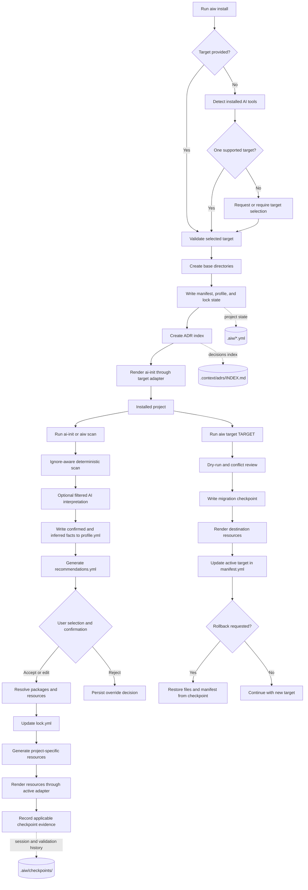

# AI Workflow

AI Workflow is a portable, spec-driven development system for AI coding agents. It gives a repository a repeatable path from discovery and brainstorming to requirements, implementation plans, code, and verification evidence without coupling the project to one AI provider.

It can configure Codex, Claude Code, Cursor, Gemini CLI, GitHub Copilot, or a provider-neutral layout from the same canonical project state.

## Why AI Workflow

AI-assisted development often relies on implicit prompts, duplicated configuration, and tool-specific files that drift over time. AI Workflow makes that process explicit and reviewable:

- project facts are detected before recommendations are made;
- inferred conventions require confirmation before they drive generation;
- specifications and decisions remain the source of truth;
- skills, rules, agents, hooks, and templates are versioned resources;
- target-specific files are generated through adapters;
- quality gates and checkpoints provide completion evidence;
- context is filtered and loaded only when needed to reduce token usage;
- package-declared sensitive capabilities are evaluated by policy boundaries.

## Installation

The published package supports Node.js 18 or newer. Full development checks require Node.js 20.19 or newer for the current lint and test toolchain; CI runs on Node.js 20 and release validation runs on Node.js 24. Node.js 18 remains the declared runtime floor but is not currently in the release validation matrix.

```bash
npx @multileaf/ai-workflow install --target codex
```

Then run `/ai-init` in Codex. The bootstrap scans the repository, explains project-specific recommendations, and waits for the user's selections before installing optional resources.

Supported targets are `codex`, `claude`, `cursor`, `gemini`, `copilot`, and `universal`. Every command uses the same entry point:

```bash
npx @multileaf/ai-workflow <command> <options>
```

The initial installation creates workflow state and a target-specific `ai-init` skill. Run it in a repository that does not already use the reserved bootstrap paths shown below: first installation currently writes the base ADR index and target `ai-init` file at those paths. Reinstallation detects existing AI Workflow state and preserves it.

## What gets created

For a Codex installation, the base layout is:

```text
.agents/
└── skills/
    └── ai-init/SKILL.md
.context/
└── adrs/
    └── INDEX.md
.aiw/
├── checkpoints/
├── context/
├── generated/
│   ├── artifacts/
│   ├── docs/
│   ├── plans/
│   └── specs/
├── lock.yml
├── manifest.yml
└── profile.yml
```

`.aiw/` stores the provider-neutral manifest, profile, lockfile, checkpoints, bootstrap skill, selected resources, and generated working artifacts. ADRs are stored under `.context/adrs/`. The installer intentionally adds only `ai-init` and the base project state.

Run `/ai-init` in the selected coding agent to scan the project and review evidence-based recommendations for skills, rules, agents, hooks, and templates. AI Workflow installs only the resources the user selects, then generates project-specific quality guidance from the detected stack and tools. Existing user files are preserved; conflicts are reported instead of overwritten. Hook resources are rendered according to each adapter's native or compatibility support.

The installer does not modify `.gitignore`. Add `.aiw/generated/` yourself if generated specifications, plans, and artifacts should remain local. Versioned files under `.aiw/checkpoints/` are designed to remain reviewable project history.

### Installation and configuration flow



## The SDD workflow

AI Workflow supports an end-to-end specification-driven development cycle:

```mermaid
flowchart TD
    A[Project request] --> B[Scan repository]
    B --> C[(.aiw/profile.yml)]
    C --> D[Recommend capabilities]
    D --> E[(.aiw/recommendations.yml)]
    E --> F{User confirms scope}
    F -->|Revise| B
    F -->|Proceed| G{Clarification needed?}

    G -->|Yes| H[Brainstorm]
    H --> I[(generated/specs/brainstorm.md)]
    I --> J{Brainstorm gate}
    J -->|Incomplete| H
    J -->|Complete| K[Write specification]
    G -->|No| K

    K --> L[(generated/specs/specification.md)]
    L --> M{Specification gate}
    M -->|Incomplete| K
    M -->|Complete| N{Architecture decision needed?}

    N -->|Yes| O[Create ADR]
    O --> P[(.context/adrs/ADR-NNN-title.md)]
    P --> Q[Update ADR index]
    Q --> R[(.context/adrs/INDEX.md)]
    N -->|No| S[Create implementation plan]
    R --> S

    S --> T[(generated/plans/implementation-plan.md)]
    T --> U{Plan gate}
    U -->|Incomplete| S
    U -->|Ready| V[Implement tasks with TDD]

    V --> W[Write code and tests]
    W --> X[Run task validation commands]
    X --> Y{Validation passes?}
    Y -->|No| V
    Y -->|Yes| Z[Record completion evidence]

    Z --> AA[(generated/artifacts and checkpoint evidence)]
    AA --> AB[Write verification report]
    AB --> AC{Verification gate}
    AC -->|Missing evidence| V
    AC -->|Complete| AD[Build traceability graph]

    AD --> AE[Requirement → ADR → Task → Code → Test → Evidence]
    AE --> AF[(generated artifacts and trace output)]
    AF --> AG[Run code-review skill when installed]
    AG --> AH{Review findings?}
    AH -->|Changes required| V
    AH -->|Clear| AI[Run repository self-validation]
    AI --> AJ[(.aiw/checkpoints/self-validation-TICKET.yml)]
    AJ --> AK[Commit and independent integration validation]

    B -. command history and evidence .-> LOGS[(.aiw/checkpoints/)]
    D -. command history and evidence .-> LOGS
    U -. implementation session evidence .-> LOGS
    AI -. final validation result .-> LOGS
```



```bash
# Detect the repository stack, tools, scripts, and conventions.
npx @multileaf/ai-workflow scan

# Review recommendations interactively in a TTY.
npx @multileaf/ai-workflow recommend

# In CI, provide comma-separated recommendation IDs detected for that project.
npx @multileaf/ai-workflow recommend --select=typescript-quality,verification

# Create structured product artifacts.
npx @multileaf/ai-workflow brainstorm --title="Feature name"
npx @multileaf/ai-workflow spec --title="Feature requirements"
npx @multileaf/ai-workflow adr --id=001 --title="Technical decision"
npx @multileaf/ai-workflow plan --title="Implementation plan"

# Optional, after creating a brainstorm artifact for an unclear request:
npx @multileaf/ai-workflow gate brainstorming
# After filling the specification and plan scaffolds shown above:
npx @multileaf/ai-workflow gate specification
npx @multileaf/ai-workflow gate plan
# After writing .aiw/generated/reports/verification-report.md from the verification report template:
npx @multileaf/ai-workflow gate verification
npx @multileaf/ai-workflow verify
npx @multileaf/ai-workflow trace
```

Scaffold commands write deterministic files at fixed paths and a repeated invocation replaces that scaffold. Complete and review each artifact before advancing. Requirements use stable identifiers and Given/When/Then acceptance criteria. Plans link tasks to requirements, tests, risks, dependencies, and expected evidence. Each `gate` validates the artifact named by its stage. `verify` checks that the specification has acceptance criteria and the plan links requirements to validation; it does not execute project test commands. `trace` records declared links between requirements, decisions, tasks, code, tests, and evidence. Code review is performed with the `code-review` skill when installed; there is no separate review gate command.

## Project intelligence

Analysis uses two complementary layers:

1. Deterministic detectors identify observable facts such as languages, package managers, workspaces, frameworks, scripts, tests, linters, CI, and configuration files.
2. An optional provider-neutral AI interpreter examines a filtered context to suggest architecture conventions and capabilities.

Detected facts cannot be replaced by conflicting AI output. Inferred facts remain unconfirmed until the user accepts, rejects, or edits them. Context selection excludes known sensitive filenames, binaries, dependencies, Git internals, generated output, and checkpoints, then applies pattern-based redaction. This is a defense-in-depth filter, not a general secret scanner; review eligible text before enabling an external AI provider.

## Resource packages and recommendations

Resources are distributed as versioned packages that may contain:

- skills for repeatable workflows;
- rules for project and organization policy;
- specialist agent definitions;
- lifecycle hooks;
- artifact templates;
- dependencies, permissions, target support, and provenance metadata.

```bash
npx @multileaf/ai-workflow registry
npx @multileaf/ai-workflow skills search --query=react

# Install locally before addressing files inside the package's node_modules path.
npm install --save-dev @multileaf/ai-workflow
npx @multileaf/ai-workflow audit-package \
  --package=node_modules/@multileaf/ai-workflow/resources/package.yaml
npx @multileaf/ai-workflow resolve \
  --package=node_modules/@multileaf/ai-workflow/resources/package.yaml
```

The registry can combine local packages, configured private registries, and Vercel Skills metadata. Vercel operations invoke the external `npx skills` CLI and therefore require network access outside AI Workflow's package-permission gate. Lock entries record the provider, reported version, source, permissions, and available integrity metadata. Local package entries contain a SHA-256 digest of the manifest and declared resource bytes; upstream providers may use their own integrity format.

## Switching AI targets

The neutral state can be rendered for another supported agent:

```bash
npx @multileaf/ai-workflow target claude --dry-run
npx @multileaf/ai-workflow target claude
```

Migration provides a deterministic dry-run, reports malformed neutral resources and conflicts, writes a rollback checkpoint, and handles the active `ai-init` transition. Neutral package resources are rendered to the destination adapter. It removes obsolete target files only when `.aiw/ownership.yml` proves AIW created them and their bytes are unchanged; unowned or modified files are preserved and reported. Older installations without ownership records cannot safely clean up legacy target files, so review the dry-run and resolve conflicts before migrating. If needed:

```bash
npx @multileaf/ai-workflow rollback
```

Use `capabilities --target=<target>` to inspect aggregate supported resource types, lifecycle events, and whether the target uses fallback compatibility. See [Adapter Model](docs/adapter-model.md) for the native and compatibility path matrix.

## Health, recovery, and visibility

```bash
npx @multileaf/ai-workflow status
npx @multileaf/ai-workflow doctor
npx @multileaf/ai-workflow repair
npx @multileaf/ai-workflow uninstall --dry-run
npx @multileaf/ai-workflow uninstall
npx @multileaf/ai-workflow ui
```

Install records hashes for the neutral and target resources it creates in `.aiw/ownership.yml`. Uninstall's dry-run lists files it would remove and modified or unsafe files it would preserve. Uninstall deletes only resources whose current bytes still match the inventory, removes the migration rollback checkpoint, then removes AIW state; modified resources are preserved and reported. For older installations without an ownership inventory, uninstall refuses to delete target resources because their ownership cannot be established. The local dashboard binds only to `127.0.0.1`, reads project state from `.aiw/`, and requires the exact `MIGRATE` confirmation before changing targets. `doctor` checks the required installation structure, ownership inventory, manifest schema, and active target. `repair` recreates a defined subset of required directories and files; it does not repair arbitrary malformed profile or lock content, and a missing profile may still require reinstallation or regeneration.

## Multi-agent orchestration

AI Workflow can preview and execute a strict, versioned task graph:

Create `orchestration.yml` using the schema in [Multi-agent Orchestration](docs/orchestration.md), then preview it:

```bash
npx @multileaf/ai-workflow orchestrate --plan=orchestration.yml
npx @multileaf/ai-workflow orchestrate --plan=orchestration.yml --execute --max-parallel=4
```

Preview is deterministic and read-only. Execution is opt-in and requires an application host to inject an `AgentOrchestrator`; the standalone CLI does not configure one, so its `--execute` form fails clearly until integrated by a host. Dependencies, bounded concurrency, failure propagation, replay protection, and checkpoint evidence are handled by the orchestration domain. The typed contract is exported from `@multileaf/ai-workflow/orchestration`.

## Plugins and SDK

Create portable extensions without coupling them to the CLI implementation:

```bash
npx @multileaf/ai-workflow plugin create \
  --directory=plugins/plugin-name \
  --id=owner/plugin-name \
  --version=1.0.0 \
  --description="Provide a portable workflow."
npx @multileaf/ai-workflow plugin validate --directory=plugins/plugin-name
```

The typed SDK is available from `@multileaf/ai-workflow/plugin-sdk`. It exports scaffold and validation helpers that accept an injected filesystem boundary. Those helpers validate project-relative paths and preflight scaffold conflicts; AI Workflow does not currently host arbitrary plugin runtime code or inject a filesystem into executing plugins. See [Plugin Authoring](docs/plugin-authoring.md).

## Privacy and security

Telemetry is disabled by default and requires explicit consent. It records only approved aggregate fields through an injectable transport.

```bash
npx @multileaf/ai-workflow telemetry status
npx @multileaf/ai-workflow telemetry enable
npx @multileaf/ai-workflow telemetry disable
```

Package contracts, declared permissions, and organization policy are validated at documented workflow boundaries, but not every external subprocess is covered by one global preflight. In particular, Vercel Skills delegates to `npx skills`, and Git sources may be checked out before their package manifest can be inspected. Treat third-party sources as untrusted and review dry-runs and package audits. Published npm releases include registry signatures and SLSA provenance that consumers can verify with `npm audit signatures`. See [Security and Trust](docs/security.md) and [Telemetry and Privacy](docs/telemetry.md).

## Developing this repository

This project uses itself to validate its own workflow. Product changes follow TDD, pass the complete quality pipeline, run against this repository, and produce ticket-specific checkpoint evidence.

```bash
npm ci
npm run check
node dist/cli.js self-validate --ticket=TYPE-000
```

Release candidates additionally require:

```bash
npm run release:check
```

## Documentation

- [Documentation index](docs/README.md)
- [Product vision](docs/product-vision.md)
- [Product requirements](docs/product-requirements.md)
- [Architecture](docs/architecture.md)
- [Project intelligence](docs/project-intelligence.md)
- [Package and resource model](docs/package-model.md)
- [Adapter model](docs/adapter-model.md)
- [Quality and testing](docs/quality.md)
- [Token efficiency](docs/token-efficiency.md)
- [Multi-agent orchestration](docs/orchestration.md)
- [Release process](docs/release-process.md)

## License

[MIT](LICENSE) © 2026 MultiLeaf
